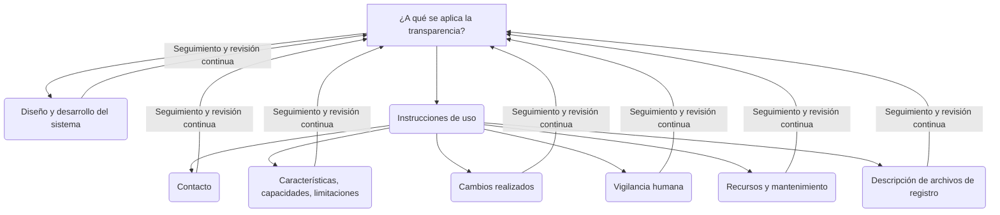

<Callout title="Material de apoyo del piloto español del AI Act" type="info">
  Esta guía fue publicada por **AESIA** en el marco del piloto español de sandbox regulatorio. Tiene carácter de **apoyo práctico**, no vinculante: las normas armonizadas aplicables se aprobarán a nivel europeo. Versión transcrita: **diciembre de 2025**. Las descargas y la versión canónica están en las [fuentes oficiales](/docs/official-sources).
</Callout>

## 1. Preámbulo

### 1.1. Objetivo del documento

El Reglamento Europeo de Inteligencia Artificial (AI Act) dedica por entero su **artículo 13** a la Transparencia.

El presente documento proporciona medidas de implementación para entidades proveedoras y usuarias de los sistemas de IA que faciliten el cumplimiento de las obligaciones expresadas en dicho artículo, dedicado a la transparencia.

### 1.2. ¿Cómo leer esta guía?

La estructura de esta guía presenta un **primer apartado** con el preámbulo

Un **segundo apartado** introductorio donde se define qué se entiende por "transparencia" y se mencionan sus características principales.

Un **tercer apartado** centrado en el Reglamento de IA y en los artículos en torno al requisito de transparencia. También se incluye una tabla con cada uno de estos artículos y sus referencias dentro de los apartados de la presente guía para facilitar su localización.

En el **cuarto apartado** se profundiza sobre el requisito de transparencia según el Reglamento de IA, recorriendo en orden todos los apartados de dicho artículo, dando respuesta a las preguntas fundamentales necesarias para facilitar el cumplimiento de las obligaciones expresadas en dichos apartados.

En el **quinto apartado** se describen las medidas necesarias a aplicar para conseguir cumplir con el principio de transparencia. En cada subapartado se hace una breve introducción a la medida, se identifica a quién aplica, se opone un ejemplo de caso de uso y, se relaciona con el punto o los puntos del articulado del Reglamento de IA a los que da respuesta.

El **sexto apartado** contempla la documentación técnica relacionada con la transparencia de los sistemas de IA y, el **apartado séptimo** hace referencia a la autoevaluación que deberán llevar a cabo los sistemas de IA.

Por último, los **apartado octavo y noveno** incluyen respectivamente un glosario de términos y, las referencias a normas y estándares que se han consultado para la realización de la presente guía.

### 1.3. ¿A quién está dirigido?

Es responsabilidad de los **proveedores** y **responsables del despliegue** de sistemas de IA de alto riesgo implementar las medidas adecuadas para asegurar las obligaciones de conservación y mantenimiento de registros que se mencionan en el Reglamento de IA. De una manera más concreta, el documento va principalmente dirigido a:

*   Los técnicos de la entidad proveedora encargados de tomar decisiones de diseño técnico que permitirán atender a dichos requisitos y diseño conceptual del sistema.
*   Los responsables de la entidad proveedora que diseñan conceptualmente el sistema de IA atendiendo a los requisitos de la entidad usuaria, quienes podrán tener en cuenta las medidas descritas en el presente documento para crear un sistema de IA transparente en función de los requisitos descritos en el Reglamento.
*   Los responsables de la entidad usuaria, quienes deberán ser conscientes de los requisitos sobre transparencia que tendrán en función del caso de uso y proceso que va a soportar el sistema de IA.

A lo largo de todo el documento se utiliza un lenguaje entendible por todos ellos, minimizando los tecnicismos necesarios para su comprensión.

### 1.4. Casos de uso y ejemplos dispuestos a lo largo de la guía

Con el fin de facilitar la comprensión de la guía, se incorporan en ésta diferentes ejemplos que pretenden servir como referencia para la adecuación de los HRAIS (por sus siglas en inglés) para la generación de registros conforme a los requisitos del reglamento.

Estos ejemplos se desarrollan en base a los casos de uso descritos en la Guía práctica y ejemplos para entender el Reglamento de IA.

Finalmente, cabe destacar que siempre que se ponga un ejemplo, se hará de manera ilustrativa. Proveedor y responsable del despliegue han de considerar la aplicación de todas las medidas indicadas en esta guía, según corresponda. Cada sistema de IA, siguiendo las directrices de esta guía, deberá identificar y aplicar las medidas más adecuadas según las características de su sistema de IA y su finalidad específica. Además, los ejemplos expuestos son específicos de los casos de uso.

Esto implica que las propuestas son específicas para los modelos considerados como ejemplo, y no una solución general para otros tipos de modelo, o incluso modelos de la misma tipología. Cada organización deberá, acorde a esta guía, establecer las medidas oportunas para su tipo de sistema de IA y su finalidad prevista.

Los ejemplos seleccionados a abordar en el presente Guía son:

*   Concesión de ayudas económicas a familias sin recursos
*   Gestión de enfermedades crónicas - Bomba de insulina inteligente

## 2. Introducción

### 2.1. ¿Qué es la transparencia en la Inteligencia Artificial?

El concepto de Transparencia en Inteligencia Artificial se define como la cualidad de un sistema de IA de poder ser enteramente interpretable y comprensible por todas las personas que lo crean e interactúan con él en todo su ciclo de vida. Es decir, desde que se conceptualiza y diseña, durante su implementación, y cuando finalmente está en funcionamiento. De esta manera es posible entender el porqué de sus razonamientos y así controlarlo adecuadamente.

Para que dicha comprensión y transparencia sea alcanzable mediante técnicas de diseño y desarrollo es necesario recurrir en ocasiones a técnicas de Explicabilidad. Este es el motivo por el cual el concepto de Transparencia está ligado a conceptos como la Explicabilidad y la Interpretabilidad, siendo utilizados estos conceptos de manera integrada en muchos de los planteamientos de los principales proveedores de sistemas de IA.

### 2.2. ¿Por qué la necesidad de transparencia?

La Inteligencia Artificial es una de las tecnologías de software más complejas de todas cuantas hemos asimilado. Ello es debido a que sus capacidades (realización de predicciones, toma de decisiones e incluso emulación de capacidades cognitivas del ser humano para realizar dichas predicciones y toma de decisiones), son similares a las del ser humano. Los mecanismos necesarios para automatizar de manera masiva estas capacidades mediante sistemas de IA conllevan una complejidad que requiere de ser explicada de manera transparente para generar confianza debido a la criticidad de las predicciones que pueda hacer o decisiones que pueda tomar. Esta Transparencia debe ser abordada desde dos vertientes:

*   Para que los responsables de la creación, funcionamiento y explotación del sistema de IA puedan entender su funcionamiento.
*   Para que los usuarios finales o responsables del despliegue puedan interpretar los resultados del sistema, ya que las personas afectadas tienen el derecho de saber en base a qué criterios e información se ha hecho una determinada predicción o tomado una decisión sobre ellas, y en qué circunstancias dicha acción podría haber sido otra si se modificaran algunas de las informaciones tenidas en cuenta.

En conclusión, cualquier predicción o decisión es difícil que tenga un consenso absoluto independientemente del contexto en el que se produzca, pero detallarla de manera lo más transparente posible al menos puede generar confianza, incluso en situaciones de desacuerdo. Por tanto, la transparencia es la base sobre la que se construye la confianza en la Inteligencia Artificial.

En el presente documento, para cada apartado del artículo del Reglamento Europeo de la IA (dedicado a la transparencia), se exponen medidas que permiten proporcionar Transparencia a sistemas de IA conforme al requisito expuesto en dicho apartado. Cada una de dichas medidas se ejemplifica de manera detallada mediante los casos de uso descritos al inicio del documento.

Para introducir al concepto de transparencia y a la importancia de su necesidad, mediante el caso de uso de concesión de ayudas se utilizan dos sencillas preguntas:

*   ¿Qué ocurriría si la entidad proveedora del sistema no proporcionase los mecanismos necesarios para que el responsable de conceder las ayudas en la entidad usuaria pudiera conocer en base a qué criterios concretos se han concedido o denegado cada una de las ayudas?
*   ¿Qué ocurriría si las familias a las que se le deniegan las ayudas recibieran como respuesta un escueto “NO”, sin detallarles el porqué de dicha negativa, ¿o en qué circunstancias sí se les pudiera dar la ayuda?

La respuesta a ambas preguntas es la misma: el sistema de IA no sería transparente, y no se podría confiar en él para ser integrado en un proceso tan importante como la concesión de ayudas económicas para familias sin recursos.

Estas cuestiones son especialmente relevantes en los sistemas de IA respecto a un sistema informático "tradicional” (programado). El motivo es que en un sistema informático programado estas respuestas tienen una respuesta que siempre puede ser plenamente explicada, pues está contenida en el programa informático (tecnologías bien conocidas y con largo recorrido y de naturaleza estable con cambios siempre ligados a la intervención de un programador humano, no sujeta, por ejemplo, a procesos de aprendizaje que pueden cambiar su comportamiento), mientras que en un sistema de IA estos requerimientos de transparencia son mucho más complejos de gestionar y conseguir por los motivos indicados anteriormente. Por tanto, es fundamental tomar consciencia de dicha complejidad y tomar las medidas necesarias que permitan conseguir transparencia.

Una manera de visualizar de forma resumida la manera de lidiar con la transparencia como se conoce en el reglamento en sistemas de IA es:



## 3. Reglamento de Inteligencia Artificial

La puesta en servicio o la utilización de sistemas de IA de alto riesgo debe supeditarse al cumplimiento de determinados requisitos obligatorios, entre los cuales está el de transparencia. Estos requisitos tienen como objetivo garantizar que los sistemas de IA de alto riesgo disponibles en la Unión o cuyos resultados de salida se utilicen en la Unión no representen riesgos inaceptables para intereses públicos importantes reconocidos y protegidos por el Derecho de la Unión.

En este apartado se incluye los artículos referentes a la generación de registros del Reglamento 2024/1689 del Parlamento Europeo y del Consejo, de 13 de junio de 2024 (Reglamento Europeo de Inteligencia Artificial) y se detalla en que secciones de esta guía se abordan los diferentes elementos de dichos artículos.

### 3.1. Análisis previo y relación de los artículos

Las obligaciones sobre la generación de transparencia se encuentran principalmente en un artículo del Reglamento Europeo de IA, artículo 13 “Transparencia y comunicación de información a los responsables del despliegue”.

A modo resumen, el Artículo 13 del Reglamento Europeo de la IA, se divide en tres apartados:

*   El **primer apartado** expone la obligación general de diseñar y desarrollar sistemas de IA permitiendo que los usuarios comprendan y utilicen adecuadamente el sistema.
*   El **segundo apartado** expone la necesidad de proporcionar instrucciones de uso que incluyan información concisa, completa, correcta y clara que sea pertinente, accesible y comprensible para los usuarios.
*   El **apartado tercero** concreta un conjunto de información específica sobre la cual se deben aplicar los objetivos globales marcados por los dos primeros.

A continuación, se detalla cada uno de los apartados/subapartados del mencionado artículo 13, indicando para cada uno de ellos las medidas necesarias para abordar los requisitos.

### 3.2. Contenido de los artículos en el Reglamento de IA

**AI Act**
**Art. 13 - Transparencia y comunicación de información a los responsables del despliegue**

1.  Los sistemas de IA de alto riesgo se diseñarán y desarrollarán de un modo que se garantice que funcionan con un nivel de transparencia suficiente para que los responsables del despliegue interpreten y usen correctamente sus resultados de salida. Se garantizará un tipo y un nivel de transparencia adecuados para que el proveedor y el responsable del despliegue cumplan las obligaciones pertinentes previstas en la sección 3.

2.  Los sistemas de IA de alto riesgo irán acompañados de las instrucciones de uso correspondientes en un formato digital o de otro tipo adecuado, las cuales incluirán información concisa, completa, correcta y clara que sea pertinente, accesible y comprensible para los responsables del despliegue.

3.  Las instrucciones de uso contendrán al menos la siguiente información:
    a) la identidad y los datos de contacto del proveedor y, en su caso, de su representante autorizado;
    b) las características, capacidades y limitaciones del funcionamiento del sistema de IA de alto riesgo, con inclusión de:
        i) su finalidad prevista,
        ii) el nivel de precisión (incluidos los parámetros para medirla), solidez y ciberseguridad mencionado en el artículo 15 con respecto al cual se haya probado y validado el sistema de IA de alto riesgo y que puede esperarse, así como cualquier circunstancia conocida y previsible que pueda afectar al nivel de precisión, solidez y ciberseguridad esperado,
        iii) cualquier circunstancia conocida o previsible, asociada a la utilización del sistema de IA de alto riesgo conforme a su finalidad prevista o a un uso indebido razonablemente previsible, que pueda dar lugar a riesgos para la salud y la seguridad o los derechos fundamentales a que se refiere el artículo 9, apartado 2,
        iv) en su caso, las capacidades y características técnicas del sistema de IA de alto riesgo para proporcionar información pertinente para explicar sus resultados de salida,
        v) cuando proceda, su funcionamiento con respecto a determinadas personas o determinados colectivos de personas en relación con los que esté previsto utilizar el sistema,
        vi) cuando proceda, especificaciones relativas a los datos de entrada, o cualquier otra información pertinente en relación con los conjuntos de datos de entrenamiento, validación y prueba usados, teniendo en cuenta la finalidad prevista del sistema de IA de alto riesgo,
        vii) en su caso, información que permita a los responsables del despliegue interpretar los resultados de salida del sistema de IA de alto riesgo y utilizarla adecuadamente;
    c) los cambios en el sistema de IA de alto riesgo y su funcionamiento predeterminado por el proveedor en el momento de efectuar la evaluación de la conformidad inicial, en su caso;
    d) las medidas de supervisión humana a que se hace referencia en el artículo 14, incluidas las medidas técnicas establecidas para facilitar la interpretación de los resultados de salida de los sistemas de IA de alto riesgo por parte de los responsables del despliegue;
    e) los recursos informáticos y de hardware necesarios, la vida útil prevista del sistema de IA de alto riesgo y las medidas de mantenimiento y cuidado necesarias (incluida su frecuencia) para garantizar el correcto funcionamiento de dicho sistema, también en lo que respecta a las actualizaciones del software;
    f) cuando proceda, una descripción de los mecanismos incluidos en el sistema de IA de alto riesgo que permita a los responsables del despliegue recabar, almacenar e interpretar correctamente los archivos de registro de conformidad con el artículo 12.

### 3.3. Correspondencia del articulado con los apartados de la guía

En la tabla dispuesta a continuación se detalle en que secciones de esta guía se abordan los diferentes elementos del articulado:

| Artículo Reglamento | Requerimiento Reglamento                                             | Sección guía     |
| :------------------ | :------------------------------------------------------------------- | :--------------- |
| 13.1                | Diseño y desarrollo de los sistemas de IA de alto riesgo             | Apartado 4.1     |
| 13.2                | Instrucciones de uso para los sistemas de IA de alto riesgo          | Apartado 4.2     |
| 13.3                | Información específica sobre las instrucciones de uso                | Apartado 4.3     |
| 13.3.a              | Contacto                                                             | Apartado 4.3.1   |
| 12.3.b              | Características, capacidades y limitaciones                          | Apartado 4.3.2   |
| 12.3.b.i            | Finalidad                                                            | Apartado 4.3.2.1 |
| 13.3.b.ii           | Nivel de precisión                                                   | Apartado 4.3.2.2 |
| 13.3.b.iii          | Riesgos por usos previstos                                           | Apartado 4.3.2.3 |
| 13.3.b.iv           | Características técnicas                                             | Apartado 4.3.2.4 |
| 13.3.b.v            | Impacto en personas                                                  | Apartado 4.3.2.5 |
| 13.3.b.vi           | Datos de entrada                                                     | Apartado 4.3.2.6 |
| 13.3.b.vii          | Información de salida                                                | Apartado 4.3.2.7 |
| 13.3.c              | Cambios                                                              | Apartado 4.3.8   |
| 13.3.d              | Vigilancia humana                                                    | Apartado 4.3.4   |
| 13.3.e              | Recursos HW/SW y mantenimiento                                       | Apartado 4.3.5   |
| 13.3.f              | Archivos de registros                                                | Apartado 4.3.6   |

## 4. Requisitos sobre transparencia en el Reglamento

### 4.1. Apartado 1. Diseño y desarrollo

**AI Act**
**Art.13.1 - Transparencia y comunicación de información a los responsables del despliegue**

Los sistemas de IA de alto riesgo se diseñarán y desarrollarán de un modo que se garantice que funcionan con un nivel de transparencia suficiente para que los responsables del despliegue interpreten y usen correctamente sus resultados de salida. Se garantizará un tipo y un nivel de transparencia adecuados para que el proveedor y el responsable del despliegue cumplan las obligaciones pertinentes previstas en la sección 3.

**Qué entendemos**

Que el sistema de IA sea diseñado y desarrollado en general mediante medidas que le permitan proporcionar información acerca de su funcionamiento de manera transparente y que de esta manera los usuarios lo comprendan y utilicen adecuadamente, particularmente en las obligaciones previstas en el apartado tercero de este artículo.

Este objetivo de Transparencia está alineado con la definición reflejada en ISO 23894, sección A.7 (transparency and explainability).

**Medidas para llevarlo a cabo**

A continuación, se listan medidas a tener en cuenta en el diseño y desarrollo de sistemas de IA para que éste funcione de manera transparente (click para acceder al detalle):

*   Atender al dominio de funcionalidad
*   Asegurar el objetivo funcional del sistema
*   Transparencia sobre los datos utilizados
*   Detallar de lo más global a lo más particular
*   Adaptar el lenguaje
*   Gestionar la complejidad
*   Utilizar métricas integradas en el ciclo de vida del sistema
*   Aplicar prudencia
*   Usar causalidad y minimizar correlaciones
*   Utilizar contrafactualidad

Dado que estas medidas deben ser tenidas en cuenta en el diseño y desarrollo de los sistemas de IA, pueden estar soportadas por herramientas metodológicas de la construcción de software e incluso por tecnologías que permiten su automatización.

En el apartado tercero del Reglamento Europeo de la IA se detallan las medidas que aplican a cada una de las informaciones específicas descritas en dicho apartado.

### 4.2. Apartado 2. Instrucciones de uso

**AI Act**
**Art.13.2 - Transparencia y comunicación de información a los responsables del despliegue**

Los sistemas de IA de alto riesgo irán acompañados de las instrucciones de uso correspondientes en un formato digital o de otro tipo adecuado, las cuales incluirán información concisa, completa, correcta y clara que sea pertinente, accesible y comprensible para los responsables del despliegue.

**Qué entendemos**

Adicionalmente a las medidas a tener en cuenta en el diseño y desarrollo del sistema para que él mismo pueda proporcionar información acerca de su funcionamiento de manera transparente (primer apartado antes detallado), este segundo apartado indica la necesidad de un medio digital o de otro tipo que recopile las instrucciones de uso del sistema de manera "concisa, completa, correcta y clara que sea pertinente, accesible y comprensible para los usuarios.". Es en apartado tercero donde se especifican el conjunto de información que deberán contener dichas instrucciones.

**Medidas para llevarlo a cabo**

*   Habilitar un canal con la información de uso del sistema

### 4.3. Apartado 3. Información específica

Este apartado concreta siete informaciones específicas sobre las cuales se deben aplicar las medidas aplicables en los dos primeros apartados.

**AI Act**
**Art. 13.3 - Transparencia y comunicación de información a los responsables del despliegue**

Las instrucciones de uso contendrán al menos la siguiente información:

a) la identidad y los datos de contacto del proveedor y, en su caso, de su representante autorizado;

b) las características, capacidades y limitaciones del funcionamiento del sistema de IA de alto riesgo, con inclusión de: [...]

c) los cambios en el sistema de IA de alto riesgo y su funcionamiento predeterminados por el proveedor en el momento de efectuar la evaluación de la conformidad inicial, en su caso;

d) las medidas de supervisión humana a que se hace referencia en el artículo 14, incluidas las medidas técnicas establecidas para facilitar la interpretación de los resultados de salida de los sistemas de IA de alto riesgo por parte de los responsables del despliegue;

e) los recursos informáticos y de hardware necesarios, la vida útil prevista del sistema de IA de alto riesgo y las medidas de mantenimiento y cuidado necesarias (incluida su frecuencia) para garantizar el correcto funcionamiento de dicho sistema, también en lo que respecta a las actualizaciones del software;

f) cuando proceda, una descripción de los mecanismos incluidos en el sistema de IA de alto riesgo que permita a los responsables del despliegue recabar, almacenar e interpretar correctamente los archivos de registro de conformidad con el artículo 12.

A continuación, se detallan cada uno de dichos subapartados, indicando para cada uno de ellos, las medidas que permiten llevarlos a cabo.

En cuanto a dichas medidas, los sistemas de IA tienen la capacidad de facilitar e incluso generar automáticamente muchas de estas instrucciones de uso si se aplican buenas prácticas de diseño y desarrollo orientadas a proporcionar transparencia, requisito del apartado 1 del presente artículo.

De esta manera se consigue que dichas instrucciones estén constantemente alineadas y sincronizadas con el software sin esfuerzos paralelos y adicionales, permitiendo así que todos los usuarios que interactúan con el sistema comprendan y utilicen adecuadamente el sistema.

Las medidas descritas a continuación, se pueden categorizar en dos tipos:

*   **Medidas de diseño** que facilitan la consecución de los requisitos de transparencia
    *   Proporcionar contacto con el proveedor.
    *   Atender al dominio de funcionalidad.
    *   Asegurar el objetivo funcional del sistema.
    *   Aplicar prudencia.
    *   Usar causalidad, minimizar correlaciones.
    *   Habilitar un canal con la información de uso del sistema.
*   **Medidas que pueden ser automatizables de manera directa.** Este documento no entra a describir las tecnologías subyacentes que existen por detrás de dichas medidas, pero describe las funcionalidades de dichas tecnologías, ya sean propietarias de fabricante o incluso opensource de libre distribución.
    *   Transparencia sobre los datos utilizados.
    *   Detallar de lo más global a lo más particular.
    *   Adaptar el lenguaje.
    *   Utilizar métricas integradas en el ciclo de vida del sistema.
    *   Utilizar contrafactualidad.

#### 4.3.1. Apartado 3a. Contacto

**AI Act**
**Art.13.3a Transparencia y comunicación de información a los responsables del despliegue**
la identidad y los datos de contacto del proveedor y, en su caso, de su representante autorizado;

**Qué entendemos**

Dado que son sistemas de IA de alto riesgo, pretende asegurar el servicio de soporte proporcionado por el proveedor del sistema de IA a la entidad usuaria del mismo mediante un canal que permita al usuario contactar en caso de duda o reclamación referida al sistema de IA.

**Medidas para llevarlo a cabo**

*   Proporcionar contacto con el proveedor

#### 4.3.2. Apartado 3b. Características, capacidades y limitaciones

Este apartado concreta seis aspectos a tener en cuenta.

**AI Act**
**Art.13.3b Transparencia y comunicación de información a los responsables del despliegue**
las características, capacidades y limitaciones del funcionamiento del sistema de IA de alto riesgo, con inclusión de:

i) su finalidad prevista,
ii) el nivel de precisión (incluidos los parámetros para medirla), solidez y ciberseguridad mencionado en el artículo 15 con respecto al cual se haya probado y validado el sistema de IA de alto riesgo y que puede esperarse, así como cualquier circunstancia conocida y previsible que pueda afectar al nivel de precisión, solidez y ciberseguridad esperado,
iii) cualquier circunstancia conocida o previsible, asociada a la utilización del sistema de IA de alto riesgo conforme a su finalidad prevista o a un uso indebido razonablemente previsible, que pueda dar lugar a riesgos para la salud y la seguridad a los derechos fundamentales a que se refiere el artículo 9, apartado 2,
iv) en su caso, las capacidades y características técnicas del sistema de IA de alto riesgo para proporcionar información pertinente para explicar sus resultados de salida,
v) cuando proceda, su funcionamiento con respecto a determinadas personas o determinados colectivos de personas en relación con los que esté previsto utilizar el sistema,
vi) cuando proceda, especificaciones relativas a los datos de entrada, o cualquier otra información pertinente en relación con los conjuntos de datos de entrenamiento, validación y prueba usados, teniendo en cuenta la finalidad prevista del sistema de IA de alto riesgo,
vii) en su caso, información que permita a los responsables del despliegue interpretar los resultados de salida del sistema de IA de alto riesgo y utilizarla adecuadamente;

A continuación, se detallan cada uno de los subapartados, indicando para cada uno de ellos, el porqué de su necesidad, así como las medidas para llevarlos a cabo.

##### 4.3.2.1. Apartado 3b.i. Finalidad

**AI Act**
**Art.13.3b.i Transparencia y comunicación de información a los responsables del despliegue**
su finalidad prevista,

**Qué entendemos**

Asegurar el entendimiento funcional de todo el sistema, un objetivo que debe aplicarse desde la concepción y diseño del mismo, para que durante su explotación este entendimiento sea viable. Si no es así:

*   El sistema no será transparente, y por tanto su supervisión y control no será posible en los términos necesarios.
*   Puede provocar especulaciones sobre cómo funciona, lo que puede reducir la confianza en el mismo si su funcionamiento no cumple con las expectativas.

**Medidas para llevarlo a cabo**

*   Atender al dominio de la funcionalidad del sistema para definir las medidas de Transparencia necesarias en el caso de uso concreto en el que será utilizado el sistema de IA.

##### 4.3.2.2. Apartado 3b.ii. Nivel de precisión

**AI Act**
**Art.13.3b.ii Transparencia y comunicación de información a los responsables del despliegue**
el nivel de precisión (incluidos los parámetros para medirla), solidez y ciberseguridad mencionado en el artículo 15 con respecto al cual se haya probado y validado el sistema de IA de alto riesgo y que puede esperarse, así como cualquier circunstancia conocida y previsible que pueda afectar al nivel de precisión, solidez y ciberseguridad esperado,

**Qué entendemos**

Asegurar el entendimiento sobre las métricas de precisión, solidez y ciberseguridad del sistema de IA, confirmando un buen ajuste entre el alcance de uso considerado por el proveedor y la intención de adopción del usuario.

**Medidas para llevarlo a cabo**

A continuación, se listan medidas a tener en cuenta en el diseño y desarrollo del sistema de IA para facilitar la creación de dichas métricas que facilitarán la Transparencia:

*   Gestionar la complejidad del sistema de IA, optando por la complejidad más sencilla que resuelva el nivel de precisión necesario.
*   Utilizar métricas de precisión integradas en el ciclo de vida del sistema de IA.
*   Usar causalidad y minimizar correlaciones, ya que un excesivo uso de correlaciones puede complicar el nivel de precisión.
*   Todas aquellas medidas indicadas en las guías del artículo 15 del Reglamento Europeo de la IA (Precisión, solidez y ciberseguridad).

##### 4.3.2.3. Apartado 3b.iii. Riesgos por usos previstos

**AI Act**
**Art.13.3b.iii Transparencia y comunicación de información a los responsables del despliegue**
cualquier circunstancia conocida o previsible, asociada a la utilización del sistema de IA de alto riesgo conforme a su finalidad prevista o a un uso indebido razonablemente previsible, que pueda dar lugar a riesgos para la salud y la seguridad o los derechos fundamentales a que se refiere el artículo 9, apartado 2.

**Qué entendemos**

Hay que asegurar que el sistema de IA es utilizado con la finalidad prevista en su creación, y no otros alternativos (conocidos o potenciales) que pudieran desvirtuar el uso para el cual fue inicialmente concebido dicho sistema suponiendo un riesgo para la salud, la seguridad o los derechos fundamentales.

**Medidas para llevarlo a cabo**

*   Asegurar el objetivo funcional del sistema
*   Lo relacionado con la guía de Gestión de riesgos (Artículo 9, apartado 2)

##### 4.3.2.4. Apartado 3b.iv. Explicación de sus resultados de salida

**AI Act**
**Art.13.3b.iv Transparencia y comunicación de información a los responsables del despliegue**
en su caso, las capacidades y características técnicas del sistema de IA de alto riesgo para proporcionar información pertinente para explicar sus resultados de salida,

**Qué entendemos**

En caso de que se requiera, las instrucciones de uso del sistema de IA, deben proporcionar información detallada sobre las características, los parámetros o la documentación técnica que utiliza el sistema para tomar decisiones, permitiendo a los responsables del despliegue entender y evaluar la lógica interna del modelo.

Este requisito busca garantizar la transparencia, facilitando la trazabilidad y responsabilidad en el uso de IA.

**Medidas para llevarlo a cabo**

*   Aplicar medidas de Transparencia sobre los datos utilizados, teniendo en cuenta cual será la salida del sistema.
*   Detallar de lo más global a lo más particular que pueda producirse en dicha salida.
*   Adaptar el lenguaje para garantizar el entendimiento de sus resultados de salida.
*   Aplicar prudencia y no revelar información sensible en la salida del sistema.
*   Utilizar contrafactualidad para detallar en la salida qué el porqué de dicha acción o en qué circunstancias dicha acción podría haber sido otra si se modificaran algunas de las informaciones tenidas en cuenta.

##### 4.3.2.5. Apartado 3b.v. Impacto en personas

**AI Act**
**Art.13.3b.v Transparencia y comunicación de información a los responsables del despliegue**
cuando proceda, su funcionamiento con respecto a determinadas personas o determinados colectivos de personas en relación con los que esté previsto utilizar el sistema,

**Qué entendemos**

Garantizar que no haya acciones injustas cuando las acciones del sistema (predicciones, decisiones) estén orientados a personas.

**Medidas para llevarlo a cabo**

*   Analizar los datos, asegurando la equidad del sistema respecto del grupo de personas en el que pueda tener influencia el sistema de IA.
*   Proporcionar mecanismos que permitan analizar de lo más global a lo más particular, asegurando así el análisis sobre grupos de personas y personas concretas.
*   Utilizar contrafactualidad para poder detallar las razones tomadas sobre personas y grupos de personas.

##### 4.3.2.6. Apartado 3b.vi. Datos de entrada

**AI Act**
**Art.13.3b.vi Transparencia y comunicación de información a los responsables del despliegue**
cuando proceda, especificaciones relativas a los datos de entrada, o cualquier otra información pertinente en relación con los conjuntos de datos de entrenamiento, validación y prueba usados, teniendo en cuenta la finalidad prevista del sistema de IA de alto riesgo.

**Qué entendemos**

Pretende dar visibilidad de la naturaleza de los datos utilizados, para que el usuario pueda entender y evaluar si la muestra de datos es justa y representativa para el objetivo del sistema.

**Medidas para llevarlo a cabo**

*   Transparencia sobre los datos utilizados

##### 4.3.2.7. Apartado 3b.vii. Información de salida

**AI Act**
**Art.13.3b.vii Transparencia y comunicación de información a los responsables del despliegue**
en su caso, información que permita a los responsables del despliegue interpretar los resultados de salida del sistema de IA de alto riesgo y utilizarla adecuadamente;

**Qué entendemos**

Asegurar el entendimiento de la información de salida del sistema.

**Medidas para llevarlo a cabo**

*   Aplicar medidas de Transparencia sobre los datos utilizados, teniendo en cuenta cual será la salida del sistema.
*   Detallar de lo más global a lo más particular que pueda producirse en dicha salida.
*   Aplicar prudencia y no revelar información sensible en la salida del sistema.
*   Utilizar contrafactualidad para detallar en la salida qué el porqué de dicha acción o en qué circunstancias dicha acción podría haber sido otra si se modificaran algunas de las informaciones tenidas en cuenta.

#### 4.3.3. Apartado 3c. Cambios

**AI Act**
**Art.13.3c Transparencia y comunicación de información a los responsables del despliegue**
los cambios en el sistema de IA de alto riesgo y su funcionamiento predeterminados por el proveedor en el momento de efectuar la evaluación de la conformidad inicial, en su caso;

**Qué entendemos**

Asegurar que la entidad usuaria es informada de los cambios realizados en el sistema por el proveedor, con las implicaciones que esto pudiera tener en su comportamiento y/o precisión. Esto es especialmente importante, ya que la evaluación inicial de conformidad establece un OK antes de poner en funcionamiento el sistema, que debe mantenerse durante el funcionamiento y evolución del mismo. Además, se da la circunstancia de que los sistemas de IA pueden degradar su rendimiento con el tiempo debido, por ejemplo, a los nuevos datos de entrada recibidos por el sistema (data drift), o bien incluso debido a cambios en el mismo (model drift).

**Medidas para llevarlo a cabo**

*   Utilizar métricas integradas en el ciclo de vida del sistema
*   Para comunicar dichos cambios será necesario habilitar un canal de comunicación entre entidad proveedora y usuaria.

#### 4.3.4. Apartado 3d. Vigilancia humana

**AI Act**
**Art.13.3d Transparencia y comunicación de información a los responsables del despliegue**
las medidas de supervisión humana a que se hace referencia en el artículo 14, incluidas las medidas técnicas establecidas para facilitar la interpretación de los resultados de salida de los sistemas de IA de alto riesgo por parte de los responsables del despliegue;

**Qué entendemos**

Aplicar medidas de transparencia sobre el sistema de IA permite entender su funcionamiento e interpretar sus resultados. Como consecuencia, y de manera bidireccional, la transparencia y la supervisión humana (desarrollada en el artículo 14 del reglamento) están completamente relacionadas, ya que para que el sistema pueda ser supervisado por personas es fundamental que el sistema sea transparente. Por tanto, todas las medidas aplicables a la transparencia y a la supervisión humana son las que resuelven este artículo.

**Medidas para llevarlo a cabo**

Todas las medidas técnicas reflejadas en el presente documento, ya que todas ellas permiten facilitar la interpretación de la información de salida del sistema de IA:

*   Atender al dominio de funcionalidad
*   Asegurar el objetivo funcional del sistema
*   Transparencia sobre los datos utilizados
*   Detallar de lo más global a lo más particular
*   Adaptar el lenguaje
*   Gestionar la complejidad
*   Utilizar métricas integradas en el ciclo de vida del sistema
*   Aplicar prudencia
*   Usar causalidad y minimizar correlaciones
*   Utilizar contrafactualidad

Adicionalmente, las indicadas en la guía del artículo 14 (Supervisión humana).

#### 4.3.5. Apartado 3e. Recursos HW/SW y mantenimiento

**AI Act**
**Art.13.3e Transparencia y comunicación de información a los responsables del despliegue**
los recursos informáticos y de hardware necesarios, la vida útil prevista del sistema de IA de alto riesgo y las medidas de mantenimiento y cuidado necesarias (incluida su frecuencia) para garantizar el correcto funcionamiento de dicho sistema, también en lo que respecta a las actualizaciones del software;

**Qué entendemos**

Este apartado está en parte relacionado con el 13.3.c, que pretende igualmente que la entidad usuaria sea informada de los cambios realizados en el sistema como parte de su mantenimiento y evolución por el proveedor, con las implicaciones que esto pudiera tener en su comportamiento y/o precisión y así garantizar su correcto funcionamiento ante los mismos.

**Medidas para llevarlo a cabo**

*   Utilizar un sistema de integración continua sobre el sistema de IA y su utilización (incluyendo los datos procesados por el usuario), aplicando métricas integradas en el ciclo de vida del sistema que permitan medir la utilización, el rendimiento y el impacto de las actualizaciones en el mismo.

#### 4.3.6. Apartado 3f. Archivos de registro

**AI Act**
**Art.13.3f Transparencia y comunicación de información a los responsables del despliegue**
cuando proceda, una descripción de los mecanismos incluidos en el sistema de IA de alto riesgo que permita a los responsables del despliegue recabar, almacenar e interpretar correctamente los archivos de registro de conformidad con el artículo 12.

**Qué entendemos**

En la línea de facilitar el entendimiento y uso apropiado de los sistemas por parte de los usuarios, se trata de describir e implantar los mecanismos contenidos dentro del propio sistema de IA de alto riesgo para permitir que los usuarios del propio sistema puedan recoger, guardar e interpretar correctamente los logs, siempre que estos sean considerados relevantes. Pretende definir el alcance de lo que una IA transparente debería ser. Concretamente, menciona que los usuarios del sistema deberían poder recoger, guardar e interpretar los logs del sistema siempre que estos sean relevantes.

**Medidas para llevarlo a cabo**

*   Las indicadas en la guía del artículo 12 del Reglamento Europeo de la IA (Registros).

## 5. Medidas aplicables para conseguir Transparencia

Este capítulo recoge las medidas de diseño y desarrollo que permiten que un sistema de IA sea Transparente (Apartado 1 del artículo 13), y que además son aplicables a la información específica que recoge el Apartado 3 de dicho artículo para que ésta pueda ser transmitida de manera Transparente.

### 5.1. Proporcionar contacto con el proveedor

La labor del proveedor no termina con la implantación, sino que también continua a partir de que el sistema está en producción. Esta relación, habitual en cualquier sistema software, es especialmente importante en los sistemas de IA, dada su complejidad, y particularmente en los de alto riesgo dada la criticidad de los procesos que soportan. Por tanto, dentro de su estructura organizativa y del modelo de gobierno asociada al sistema de IA proporcionado, las entidades proveedoras habilitarán para sus entidades responsables del despliegue un punto de contacto claro. Las funciones de dicho contacto serán como mínimo:

*   Supervisar de manera proactiva que el sistema cumple la normativa, teniendo en cuenta que el cumplimiento es una actividad constante en el tiempo por dos motivos:
    *   Al igual que cualquier otro sistema software es susceptible de cometer errores, está sujeto a políticas de actualización, etc.
    *   Aun no teniendo errores propios del software, su proceso de aprendizaje y sus acciones posteriores (predicciones, toma de decisiones, etc.) puede acabar degradando debido a la aparición de nuevos escenarios.
*   Atender de manera reactiva a las peticiones realizadas por la entidad responsable del despliegue, ya sea por incidencias detectadas por ésta, bien por solicitudes orientadas a entender el funcionamiento del sistema de IA. Sin perjuicio de los mecanismos del proveedor existentes para la atención y resolución de incidencias del sistema de IA.

El canal de contacto deberá permitir la gestión de las peticiones e incidencias de la entidad responsable del despliegue de manera online mediante el registro de las mismas, su gestión a través de workflows de trabajo por parte de los perfiles funcionales y técnicos de la entidad proveedora necesarios para su resolución, la monitorización de todas las peticiones e incidencias gestionadas, y el histórico necesario para su resolución, etc. Estos procesos podrán ser soportados por un canal de la demanda IT, un estándar de dicha industria.

**A quién aplica**

*   El proveedor deberá proporcionar dicho contacto y el canal a través del cual se producirá.
*   El responsable del despliegue deberá igualmente identificar a los responsables dentro de su organización encargados de activar dicho contacto con el proveedor ante situaciones como las anteriormente descritas.

**Ejemplo - Concesión de ayudas**

Los responsables de la entidad responsable del despliegue detectan que la cuantía propuesta para la ayuda de una familia no es homogénea respecto a otras proporcionadas en el pasado a familias con características similares. Dichos responsables activan el contacto con el proveedor mediante la apertura de una petición en el sistema de gestión de la demanda.

**Ejemplo - Bomba de insulina**

Un responsable médico de la entidad responsable del despliegue detecta mediante una alarma proporcionada por el sistema que la siguiente dosis prescrita a un paciente no es la habitual pese a tener parámetros similares en sangre. Dicho responsable médico activa el contacto con el proveedor mediante la apertura de una petición en el sistema de gestión de la demanda, además de tomar las medidas oportunas bajo su criterio médico sobre la dosis, y contactar con el paciente para entender posibles variables médicas de entorno no contempladas por el sistema de IA.

**A qué apartados aplica esta medida**

*   Apartado 3a. Contacto
*   Apartado 3c. Cambios

### 5.2. Atender al dominio de la funcionalidad

Esta medida es trivial en cualquier sistema informático, pero cobra especial importancia al tratarse de la aplicación de una tecnología con las peculiaridades de la Inteligencia Artificial, dado que se pueden plantear escenarios diferentes no identificados con otro tipo de tecnologías.

Por eso, durante el diseño del sistema de IA, es fundamental identificar cuáles son las necesidades de transparencia aplicables al dominio al que pertenece (Seguros, Finanzas, Sanidad, Retail, Trasporte, Industria, AAPP, etc.), identificar las características claves de Transparencia que se han de tener en cuenta en cada caso de uso y el porqué de las mismas ya que, por ejemplo, las necesidades de transparencia son diferentes para un sistema de identificación biométrica que para uno dedicado a la gestión de infraestructuras críticas en el sector industrial. Incluso son diferentes en función del caso de uso concreto de ambas tipologías, ambas categorizadas como de alto riesgo por el reglamento.

Todo ello sin perjuicio de la legislación específica en materia de transparencia, en particular en las AAPP.

**Ejemplo - Concesión de ayudas**

En nuestro caso de uso, estas son los principales requisitos que deberán ser soportados por el sistema atendiendo al dominio de la funcionalidad del mismo y que, atendiendo a la transparencia, deberán ser explícitamente expuestos en las condiciones de uso del sistema. Además, se deberá poder monitorizar durante el funcionamiento del sistema que dichos criterios se siguen manteniendo y que no se degeneran durante su funcionamiento:

*   El criterio global que se está siguiendo para predecir el riesgo de exclusión social, o para conceder las ayudas, Por ejemplo:
    *   Familia que lleve un determinado periodo de tiempo con ingresos inferiores a una determinada cantidad mensual.
    *   Que dicha cantidad esté ponderada por el número de miembros y edad de los mismos, dando más peso a los miembros en edad escolar sin capacidad de aportar recursos económicos a la familia a corto/medio plazo.
    *   Que tenga gastos recurrentes (p. ej.: hipoteca, tratamientos médicos no cubiertos por la seguridad social, etc.).
    *   Que dicho criterio pondere con más peso aquellas familias que tengan miembros dependientes o con algún tipo de minusvalía.
    *   El grado de desarrollo económico de la geografía en la que se ubique el lugar de residencia.
    *   Dado que el sistema ha sido entrenado con datos históricos de estructuras familiares de décadas anteriores y de familias tradicionales que siguen siendo mayoría en la actualidad, sobre las que se realizan predicciones, se asegure el mismo trato a familias con nuevas estructuras familiares (por ejemplo, monoparentales/parentales, constituidas por personas del mismo género, etc.).
*   El sistema deberá poder comparar decisiones tomadas sobre un conjunto de familias con características similares en base a los criterios anteriormente indicados, permitiendo comprobar que las decisiones son homogéneas en dicho conjunto.
*   El sistema deberá poder detallar internamente, y a la familia solicitante, el motivo por el cual se concede/deniega la ayuda, en base al criterio global de funcionamiento del sistema. En caso de denegación se deberán detallar, por ejemplo, en qué condiciones se les concedería, o a partir de cuándo.

**Ejemplo - Bomba de insulina**

Estos son algunos de los requisitos que deberán ser soportados por el sistema atendiendo al dominio del negocio del mismo y que deberán ser explícitamente expuestos en las condiciones de uso del sistema. Además, se deberá poder monitorizar durante el funcionamiento del mismo que dichos criterios se siguen manteniendo y que no se degeneran durante su funcionamiento:

*   El criterio global seguido para predecir una tendencia y realizar el suministro de insulina de manera automática; detallando las variables en sangre y sus valores, el historial médico del paciente, las condiciones medioambientales y, como consecuencia, la dosis suministrada.
*   El sistema deberá poder comparar decisiones tomadas sobre un conjunto de pacientes con características similares en base a los criterios anteriormente indicados, permitiendo asegurar que las decisiones son homogéneas en dicho conjunto.
*   El sistema deberá poder detallar internamente y a un paciente concreto el motivo por el cual se le varía la dosis, en base al criterio global de funcionamiento del sistema anteriormente descrito.

**A quién aplica**

Esta medida aplica a la **entidad responsable del despliegue** ya que, es la responsable de definir los requisitos funcionales del sistema de IA que soportará su caso de uso, atendiendo al dominio de negocio de dicho caso. Estos requisitos son independientes de la tecnología utilizada y el proveedor que se la proporcione. Como parte de dichos requisitos deberá identificar los relacionados con la transparencia del mismo.

Por otra parte, el **proveedor** deberá informar con detalle del alcance funcional del sistema de IA que pone finalmente a disposición de la entidad responsable del despliegue, para que esta pueda asegurar la alineación entre sus necesidades y las soportadas por dicho sistema, especificando también los posibles riesgos por usos no previstos tal y como indica el apartado 3b.iii del presente artículo.

**A qué apartados aplica esta medida**

*   Apartado 1. Diseño y desarrollo
*   Apartado 3b.i. Finalidad
*   Apartado 3d. Vigilancia humana

### 5.3. Asegurar el objetivo funcional del sistema

Para asegurar el objetivo funcional del sistema, y gestionar el riesgo de que sea utilizado para un fin distinto para el que fue concebido será necesario:

*   Identificar las circunstancias previsibles donde pudieran darse dichos usos.
*   Definir un plan de riesgos para dichos usos, supervisando de manera proactiva que dichos escenarios no se producen durante el funcionamiento del sistema (descrito en la guía de gestión de riesgos, artículo 9).

**A quién aplica**

Esta medida de supervisión aplica tanto a la entidad proveedora como a la responsable del despliegue, siendo el contacto de la entidad proveedora y su espejo en el responsable del despliegue los roles de dicha supervisión.

**Ejemplo - Concesión de ayudas**

El sistema de concesión de ayudas utiliza datos de la unidad familiar. Dichos datos han de ser tratados con especial vigilancia, asegurando que su uso se circunscriba únicamente al objetivo funcional del sistema (la concesión de ayudas), ya que menores de dieciocho años pueden formar parte de dicha unidad familiar, y este grupo de personas es especialmente detallado en el Artículo 9 del Reglamento Europeo de la IA (gestión de riesgos), indicando que "se prestará especial atención a la probabilidad de que personas menores de dieciocho años se vean afectadas”. El potencial uso de dichos datos con una finalidad distinta a la prevista debe ser especialmente gestionado, y además previsto en el plan de riesgos del sistema de IA.

**Ejemplo - Bomba de insulina**

El sistema de administración de insulina utiliza datos aplicables específicamente a un paciente en función de su patología y de su estado actual, en base a los cuales determina la dosis exacta necesaria que el paciente deberá cargar, ya que este es uno de los beneficios de utilizar este sistema. Dicha información es obtenida del historial médico del paciente y de los datos online que el sistema recoge del mismo.

El sistema deberá informar al paciente de manera transparente que el producto inoculado es el prescrito por su médico responsable y no otra variante, que la dosis incorporada al dispositivo por el paciente es la prescrita por el dispositivo en función del análisis online de su situación realizada por el dispositivo, y que dicha dosis está validada por el médico.

**A qué apartados aplica esta medida**

*   Apartado 1. Diseño y desarrollo
*   Apartado 3b.iii. Riesgos por usos previstos
*   Apartado 3d. Vigilancia humana

### 5.4. Transparencia sobre los datos utilizados

Es fundamental conocer el funcionamiento del sistema de IA. Pero también es fundamental comprender los datos que maneja dicho sistema (estructurados o no estructurados, imágenes o lenguaje natural, por ejemplo). Esta acción se debe aplicar tanto para datos para el aprendizaje del sistema de IA como para los datos de utilización en si por el responsable del despliegue. De esta manera se podrá:

*   Detallar con Transparencia los resultados que proporcione el sistema de IA.
*   Entender, y evaluar si la muestra de datos es justa y representativa para el objetivo del sistema de IA.

Para ello, es importante:

*   Enumerar las fuentes de datos utilizadas por el sistema,
*   Realizar un análisis exploratorio de datos (EDA) de dichas fuentes, para conocer su esencia, su metainformación asociada, los valores críticos o atípicos de los mismos, etc., entendiendo su significado ya que, a veces, las características de un conjunto dado de datos son visibles a primera vista, pero otras veces están entrelazadas, y esto puede tener implicaciones para aplicar transparencia al sistema.

**A quién aplica**

*   Al responsable del despliegue, ya que es el propietario final de los datos utilizados por dicho sistema, y debe ser conocedor del significado de sus datos, su utilidad y la implicación en el uso de los mismos.
*   Al proveedor, ya que es quien debe proporcionar las herramientas que permitan el análisis descriptivo y exploratorio de los datos.

**Ejemplo - Concesión de ayudas**

Enumeración de las fuentes de datos utilizadas:

*   Información histórica de la evolución de familias que tuvieron carencias económicas y finalmente necesitaron de algún tipo de ayuda.
*   Información con el contexto económico general de la geografía a la que pertenecían cuando se produjo dicha situación.
*   Datos macroeconómicos acerca del contexto económico actual y previsiones del mismo.

Análisis exploratorio de datos (EDA) de dichas fuentes con el objetivo de asegurar que las fuentes de datos incluyen, por ejemplo:

*   Familias de distintas ubicaciones geográficas.
*   Familias que, aunque en periodos importantes hayan llegado a tener ingresos suficientes, finalmente han derivado en una situación de exclusión social (situación atípica pero posible), con datos que permitan entender cómo finalmente llegaron a dicha situación.
*   Familias que ni tan siquiera tienen registro de ingresos, lo cual puede excluirles del proceso al ser un valor crítico no contemplado.
*   Metainformación no visible a primera vista, como la relación entre familia en situación de exclusión y miembros de la misma con necesidades de dependencia o pertenecientes a grupos de personas vulnerables (p. ej., por cualquier tipo de discapacidad).
*   Datos actuales, pero también históricos que permitan detectar el riesgo futuro en base a patrones.
*   Que los datos macroeconómicos incluyen todos los sectores profesionales en los que cualquier familia pueda centrar su actividad.

**Ejemplo - Bomba de insulina**

Enumeración de las fuentes de datos utilizadas, como, por ejemplo:

*   Información histórica de los parámetros en sangre evaluados por el sistema para la administración de la dosis.
*   Información histórica de las dosis suministradas a todos los pacientes, así como su reacción a las mismas.
*   Información de los compuestos suministrados

Análisis exploratorio de datos (EDA) de dichas fuentes con el objetivo de asegurar que las fuentes de datos incluyen, por ejemplo:

*   Pacientes de distintas geografías con diferentes condiciones climáticas.
*   Pacientes de diferentes edades, sexo, características morfológicas (peso, altura, etc.), nivel de actividad física, etc.
*   Casos de reacciones adversas a las dosis suministradas, con datos que permitan entender qué produjo dicha reacción.
*   Datos de pacientes sin más patologías que la diabetes, así como datos de pacientes con otras patologías adicionales.

**A qué apartados aplica esta medida**

*   Apartado 1. Diseño y desarrollo
*   Apartado 3b.v. Impacto en personas
*   Apartado 3b.vi. Datos de entrada
*   Apartado 3b.vii. Información de salida
*   Apartado 3d. Vigilancia humana

### 5.5. Detallar de lo más global a lo más particular

La información interna proporcionada por el sistema de IA debe ser concisa y lo más completa posible, por tanto, es necesario comprender el funcionamiento de dicho sistema desde lo más general a lo más particular, habilitando medidas técnicas que permitan abordar el mayor grado posible de detalle en:

*   El mecanismo de razonamiento global del sistema de IA.
*   Las predicciones y decisiones tomadas sobre un subconjunto de información con características parecidas, para garantizar la homogeneidad de su funcionamiento.
*   E incluso de cada una de dichas predicciones y decisiones de manera individual.

**A quién aplica**

El proveedor deberá dotar al sistema de los mecanismos técnicos que faciliten esta necesidad y así asegurar a la entidad usuaria el completo control y entendimiento del sistema bajo un lenguaje entendible por todos los actores que interactúan con él a lo largo de todo su ciclo de vida.

**A qué apartados aplica esta medida**

*   Apartado 1. Diseño y desarrollo
*   Apartado 3d. Vigilancia humana

**Ejemplo - Concesión de ayudas**

El sistema deberá ofrecer mecanismos que permitan a la entidad responsable del despliegue conocer:

*   El criterio global seguido para conceder las ayudas (detallado en el ejemplo de la medida Atender al dominio de la funcionalidad).
*   Decisiones tomadas (evaluación del riesgo de exclusión social de una familia, tiempo en el que se produciría, importe asignado, etc.) sobre un conjunto de familias con características similares (por ejemplo, en base al número de personas que la componen, nivel de ingresos, ubicación geográfica), permitiendo comprobar a los responsables del despliegue que las decisiones son homogéneas en dicho conjunto.
*   Decisiones tomadas sobre una familia concreta, en base al criterio global de funcionamiento del sistema. Además, en caso de no concederles la ayuda, detallará bajo qué valores de los criterios utilizados les sería asignada (siguiendo el criterio de contrafactualidad).

**Ejemplo - Bomba de insulina**

El sistema deberá ofrecer mecanismos que permitan a la entidad responsable del despliegue conocer:

*   El criterio global seguido para la decisión de la dosis a administrar (detallado en el ejemplo de la medida Atender al dominio de la funcionalidad).
*   Composición de las dosis administradas, sobre un conjunto de pacientes con características médicas similares (por ejemplo, sexo, edad, estado físico, patologías adicionales, etc.), permitiendo que los facultativos puedan comprobar que las decisiones son homogéneas en dicho conjunto en un orden de magnitud lógico desde un punto de vista médico.
*   Decisiones tomadas sobre un paciente concreto, en base al criterio global de funcionamiento del sistema.

### 5.6. Adaptar el lenguaje

El sistema de IA debe ser diseñado para que pueda proporcionar información a todos los perfiles que interaccionan con él y así asegurar de manera transparente su completo entendimiento.

Son muchos los tipos de perfiles que interaccionan con el sistema de IA a lo largo de todo su ciclo de vida. Por tanto, se han de habilitar mecanismos técnicos que permitan mostrar dicha información de manera transparente y entendible por todos ellos, adecuando el tipo de lenguaje a su nivel de interlocución:

*   Los **responsables del despliegue** del sistema de IA necesitan entender mediante lenguaje natural, que las predicciones y decisiones que está proporcionando el sistema son homogéneas en usuarios finales con características similares, etc., con un enfoque orientado al objetivo de negocio del sistema.
*   Los **técnicos del proveedor**, cuyo lenguaje es técnico, cuando están construyendo el sistema de IA, necesitan explicar a los usuarios de la entidad responsable del despliegue, el razonamiento de sus modelos mediante un lenguaje entendible por éstos, y así asegurar entre ambos que el sistema cumple con el Reglamento Europeo de la IA y las políticas de la empresa. Y en toda la vida del sistema de IA deben conocer con un lenguaje técnico el razonamiento que está siguiendo dicho sistema para asegurar su correcto funcionamiento e incluso mejorar su precisión.
*   Las **personas físicas o jurídicas afectadas** por el funcionamiento del sistema de IA, que en muchas ocasiones no tiene porqué disponer de un lenguaje técnico de cualquier tipo, necesitan conocer, p.ej., los motivos por los cuales no se les ha concedido un producto o servicio y saber en qué condiciones se les concedería aplicadas a su realidad.

Para ello, además de los mecanismos técnicos necesarios para la implementación del sistema por parte de los especialistas, se requiere para el resto de los perfiles, proporcionar una interfaz de usuario que facilite la información de manera comprensible, ya sea visualmente, textualmente en lenguaje natural o por otros medios. En definitiva, un diseño de interfaz persona-sistema de IA de calidad para reforzar la transparencia de los sistemas de IA por parte de los responsables del despliegue y afectados sin conocimientos técnicos especializados.

**A quién aplica**

*   El proveedor deberá proporcionar a los responsables del despliegue los mecanismos técnicos e interfaces de usuario que faciliten esta necesidad y así asegurar el completo control y entendimiento del sistema bajo un lenguaje entendible por todos los actores que interactúan con él a lo largo de todo su ciclo de vida.
*   El responsable del despliegue hará uso de estos elementos para cubrir las necesidades de transparencia para su solución particular de negocio.

**A qué apartados aplica esta medida**

*   Apartado 1. Diseño y desarrollo
*   Apartado 3d. Vigilancia humana

**Ejemplo - Concesión de ayudas**

El sistema proporcionará una interfaz de usuario, alineada con el nivel de interlocución de cada uno de los perfiles que interactúa con él, y que facilite la siguiente información de manera entendible, visual y textualmente en lenguaje natural, sobre todo a aquellos perfiles no técnicos:

*   Los gestores de la concesión de las ayudas deben recibir información del sistema, en lenguaje natural, que les permita asegurar que está cumpliendo las políticas de concesión de ayudas, el grado de precisión que está teniendo a la hora de predecir las exclusiones sociales que finalmente se producen y que dan lugar a las ayudas, como la homogeneidad de las predicciones que está proporcionando en familias con características similares, detalles acerca de todas las predicciones y decisiones tomadas por el sistema de IA. Asimismo, los responsables de la concesión de ayudas dispondrán de cuadros de mando que les permita obtener estadísticas de los resultados.
*   Los técnicos que implementan el sistema y se encargan de su monitorización mientras está en funcionamiento, deben conocer la misma información anterior, pero desde una perspectiva técnica.
*   A las familias solicitantes, el sistema deberá poder explicarles en lenguaje natural los motivos por los cuales se les ha concedido un determinado importe y no otro, porqué se les ha denegado la solicitud y en qué condiciones aplicada a su realidad se le aceptaría, etc.

**Ejemplo - Bomba de insulina**

El sistema proporcionará una interfaz de usuario, alineada con el nivel de interlocución de cada uno de los perfiles que interactúa con el mismo, y que facilite la siguiente información de manera fácilmente entendible, visual y textualmente en lenguaje natural, sobre todo a aquellos perfiles no técnicos:

*   Los facultativos responsables de la administración de las dosis sobre sus pacientes deben recibir información del sistema, en lenguaje natural con el detalle técnico necesario desde un punto de vista médico, que les permita asegurar que las dosis suministradas están surtiendo el efecto correcto desde un punto de vista médico, atendiendo a los niveles de precisión deseados. También podrán disponer de cuadros de mando que les permita conocer la evolución del funcionamiento del sistema, así como la de los propios pacientes.
*   Los técnicos de software que implementan el sistema y se encargan de su monitorización mientras está en funcionamiento deben conocer la misma información anterior, pero desde una perspectiva técnica.
*   A los pacientes, el sistema deberá poder explicarles en lenguaje natural las dosis que están recibiendo, su efecto, etc., de la misma manera que se lo explicaría el facultativo en una de sus revisiones.

### 5.7. Gestionar la complejidad

Entender el funcionamiento de sistemas de IA para así facilitar su transparencia puede implicar el análisis de cantidades ingentes de variables y operaciones matemáticas. Por tanto, un buen diseño del sistema entendido desde la simplicidad de este, puede ser clave para lograr una mayor transparencia, ya que en ocasiones se tiende a aumentar la complejidad del sistema de IA para buscar más precisión, lo cual puede implicar la pérdida de transparencia acerca de su funcionamiento. Por tanto, es necesario medir el retorno de inversión de complicar el modelo por obtener un poco más de precisión a costa de posiblemente perder transparencia.

Es recomendable decidir en fase de diseño el modelo más sencillo que cumpla con los objetivos de negocio, simplificando así la transparencia y el entendimiento de su funcionamiento. Así es más fácil identificar qué factores afectan al sistema y poder explicarlo. Además, esta simplicidad en el sistema redunda en un menor consumo energético, algo muy importante en estos sistemas de IA, cuya necesidad de computación implica un alto impacto medioambiental.

El siguiente gráfico representa la relación entre la complejidad técnica de algunos tipos de modelos inteligentes vs la sencillez para conseguir transparencia en los mismos.

```
Complejidad del sistema
Alta
        Redes neuronales
        Bosques de decisión
        Modelos Bayesianos
        Árboles de decisión
        Regresiones
Baja
       &lt;--------------------&gt;
       Sencillez para conseguir Transparencia
       Baja                 Alta
```

**La particularidad de los modelos de caja negra/caja blanca**

A los sistemas de "caja blanca" se les suele llamar "transparentes", y son aquellos en los que es más sencillo entender su comportamiento. Ejemplos de este tipo de modelos son las regresiones lineales y los árboles de decisión. Por el contrario, los modelos de "caja negra" son aquellos en los que se conoce la entrada y salida, pero su funcionamiento interno es difícilmente comprensible incluso en ocasiones para los técnicos que la implementan. Ejemplos de sistemas de "caja negra" son los bosques de decisión y las redes neuronales.

Los modelos de caja negra ofrecen una gran precisión y pueden solucionar casos de uso complejos, pero su transparencia puede ser limitada dada su complicada construcción. Su falta de transparencia puede implicar tener que descartarlos para recurrir a modelos de caja blanca, directamente interpretables. Esta decisión de diseño por parte del proveedor es especialmente relevante en aplicaciones de alto riesgo donde hay que asegurar que su funcionamiento no se degenera y donde la transparencia es una necesidad ineludible.

La transparencia en sistemas de caja negra es un reto sobre el que se está investigando. Actualmente, una de las posibles soluciones para facilitar su transparencia (no al 100%) pasa por algoritmos (por ejemplo, profweight) que sondean el sistema analizando las entradas y salidas correspondientes que producen. Una vez analizados estos datos, se genera un sistema directamente interpretable equivalente que sirve para detallar el funcionamiento de la caja negra.

**A quién aplica**

*   Esta decisión de diseño aplica al proveedor del sistema de IA.
*   El responsable del despliegue deberá identificar si la complejidad del sistema que va a soportar su caso de uso puede llegar a ser bloqueante para las necesidades de transparencia sobre el sistema.

**A qué apartados aplica esta medida**

*   Apartado 1. Diseño y desarrollo
*   Apartado 3b.ii. Nivel de precisión
*   Apartado 3d. Vigilancia humana

**Ejemplo - Concesión de ayudas y bomba de insulina**

Se utilizarán árboles de decisión y regresiones lineales. Se descarta el uso de modelos probabilísticos bayesianos o redes neuronales, ya que la mejora de precisión con estos últimos podría no ser relevante, por ejemplo, en un caso de uso con alto factor probabilístico como el de la concesión de ayudas, mientras que por otro lado complicarían el objetivo de trasparencia del sistema.

### 5.8. Utilizar métricas integradas en el ciclo de vida del sistema

Las métricas permiten monitorizar el nivel de precisión, solidez y ciberseguridad (referidas en las guías que detallan el Artículo 15 del reglamento). Dichas métricas pueden aplicar a datos y sistema. Desde el punto de vista formal las métricas empleadas en datos y modelo aparecen desarrolladas en el estándar [ISO/IEC 23053]. Su uso es necesario porque los sistemas de IA degradan su rendimiento con el tiempo debido, por ejemplo, a los nuevos datos de entrada recibidos por el sistema (data drift), o bien incluso debido a cambios en el mismo (model drift).

Por tanto, es necesario:

*   Definir las métricas específicas a utilizar sobre los datos, el modelo, la calidad de los resultados y el rendimiento.
*   Validar dichas métricas en las pruebas finales antes de poner el sistema en funcionamiento.
*   Monitorizar el valor de dichas métricas durante su funcionamiento, especificando los valores mínimos aceptables a partir de los cuales es necesario, por ejemplo, reentrenar el sistema (cuando la degradación es por datos) o bien incluso parar su ejecución (por el motivo anterior y/o cuando la degradación es por un error de sistema).

Estas métricas deben estar asociadas a un sistema de integración continua sobre el sistema y sus datos (MLOps), permitiendo el análisis de dichas métricas cada vez que se produce un cambio en el sistema y/o sus datos y así identificar el nivel de las métricas definidas para cada versión. Para ello es necesario atenerse al ciclo de vida del sistema definidos en los estándares [ISO/IEC 22989] e [ISO/IEC 5338] (ver en Glosario la definición de Ciclo de Vida de un sistema de IA).

**A quién aplica**

*   El proveedor deberá proporcionar las herramientas necesarias para definir y monitorizar dichas métricas, tal y como se detalla en las guías que abarcan el Artículo 15 del reglamento.
*   El proveedor deberá incluir un sistema de integración continua (MLOps) que permita identificar cómo afectan los cambios en las diferentes versiones del sistema.
*   El usuario, como responsable final del sistema en su explotación, deberá monitorizar dichas métricas siguiendo las recomendaciones proporcionadas en las guías que detallan el Artículo 15 del reglamento.

**A qué apartados aplica esta medida**

*   Apartado 1. Diseño y desarrollo
*   Apartado 3b.ii. Nivel de precisión
*   Apartado 3c. Cambios
*   Apartado 3d. Vigilancia humana
*   Apartado 3e. Recursos HW/SW y mantenimiento

**Ejemplo - Bomba de insulina**

Se utilizarán métricas de precisión que permitan, por ejemplo, comparar las reacciones de pacientes ante determinadas dosis.

Relacionado con la integración continua, dichas métricas deberán ser especialmente monitorizadas, por ejemplo, al desplegar una nueva versión del sistema que incluya, por ejemplo, un nuevo medicamento o una nueva composición de este, o que incluya la medicación de grupos de personas con determinadas patologías adicionales anteriormente no contempladas. De esta manera, a partir de las mencionadas métricas, se garantizará de manera transparente que el sistema funciona conforme a las especificaciones esperadas.

**Ejemplo - Concesión de ayudas**

Se utilizarán métricas de precisión (especificadas en la guía de precisión, artículo 15) que permitan, por ejemplo, comparar las predicciones realizadas por el sistema sobre familias en riesgo de exclusión social que finalmente hayan derivado en dicha situación.

Relacionado con la integración continua, dichas métricas deberán ser especialmente monitorizadas, por ejemplo, al desplegar una nueva versión del sistema que incluya a una nueva región geográfica (release de datos), o que incluya la ponderación de personas dependientes o con discapacidad dentro de la familia a la hora de predecir exclusiones sociales o conceder la ayuda (release de modelo). De esta manera, a partir de las mencionadas métricas, se garantizará de manera transparente que el sistema no realiza discriminación positiva o negativa por estos nuevos conceptos incluidos en dichas releases.

### 5.9. Aplicar prudencia

La información proporcionada ha de ser pertinente. Esto implica que dicha información tiene que ser prudente, identificando los escenarios en los que la información proporcionada pueda no ser apropiada, al menos de manera pública si, por ejemplo:

*   Deriva en mayor confusión para los usuarios.
*   Puede ser aprovechadas por agentes externos para vulnerar la seguridad del sistema y/o degenerar su funcionamiento, sus procesos de aprendizaje y razonamiento. Esto es algo particular en los sistemas de IA respecto de los sistemas tradicionales, y es conocido como “ataques de envenenamiento”, concepto descrito con detalle en la guía correspondiente de ciberseguridad del artículo 15 del Reglamento Europeo de la IA.
*   Revelan información privada y confidencial, o bien sujeta a GDPR, que pueda ser apropiada por terceros de manera indebida.

**A quién aplica**

*   El responsable del despliegue, como propietario de la información, identificará la información sensible que no deba ser proporcionada ya sea porque, por ejemplo, es información confidencial de sus clientes, o bien porque incluso revele información sensible del proceso de negocio soportado.
*   El proveedor deberá implementar los filtros pertinentes para que la información no sea revelada.

**Ejemplo - Concesión de ayudas**

El sistema proporciona a las familias una respuesta de aceptación/denegación de la ayuda a través del canal web online, con argumentos que la soportan. Dichos argumentos no deben incluir, por ejemplo, información económica detallada de toda la familia, ya que parte de dicha información puede ser privada de manera individual.

**Ejemplo - Bomba de insulina**

El sistema proporciona a los pacientes un seguimiento de las dosis pasadas e inmediatas a través de una app móvil. En caso de variación en la dosis, se le explicará al paciente de manera sencilla para asegurar su entendimiento, estando dicha información securizada para evitar accesos a información confidencial por parte de terceros.

**A qué apartados aplica esta medida**

*   Apartado 1. Diseño y desarrollo
*   Apartado 3d. Vigilancia humana

### 5.10. Usar causalidad, minimizar correlaciones

La correlación no implica causalidad, ya que dos variables pueden tener una alta correlación, pero pueden no ser a causa de la otra. Un sencillo ejemplo de estos conceptos es usar directamente la estatura y no la edad para predecir si es seguro físicamente para un niño subirse a una montaña rusa. Con la estatura estaríamos utilizando una causalidad directa, mientras que con la edad estaríamos utilizando una correlación teórica que, de no cumplirse, podría producir accidentes.

La correlación puede complicar la transparencia del sistema de IA y su nivel de precisión, ya que hay que tener en cuenta la gran cantidad de variables que manejan estos sistemas, y las muchas relaciones explícitas e implícitas que pueden existir entre las mismas. El análisis de los datos puede ayudar a identificar dichas correlaciones, tal y como se detalla en la medida para la transparencia de los datos reflejada en el presente documento.

Además, la correlación puede depender de la subjetividad de quien diseña e implementa las reglas de correlación que considere además de no contemplar posibles escenarios no habituales pero relevantes en el sistema de IA. Es por tanto una potencial fuente de sesgo, y como consecuencia un riesgo en la correcta aplicación del principio de equidad.

**A quién aplica**

*   Al definir los requisitos, el responsable del despliegue deberá identificar las correlaciones válidas, así como las explícitamente no deseadas, ya que es el conocedor de la información gestionada por el sistema de IA desde una perspectiva de negocio.
*   El proveedor deberá tener identificado con detalle el modo en el que se han implementado las correlaciones, así como su impacto en la precisión del sistema.

**Ejemplo - Concesión de ayudas**

Se analizarán los datos de las fuentes disponibles tal y como se indica en la medida transparencia sobre los datos utilizados de este documento, ya que la asignación considera muchas variables y existen relaciones entre las mismas.

Por ejemplo, para la asignación de la ayuda, una de las variables utilizadas es el número de miembros de la unidad familiar. Erróneamente se puede establecer una correlación directa entre el número de miembros de la familia y la necesidad y/o el importe de la ayuda. Habrá que tener en cuenta que dicha variable deberá ser ponderada con otras variables de dichos miembros como, por ejemplo, su edad (por ejemplo, los menores de edad no tienen capacidad para aportar ingresos a la familia), o la posible pertenencia de alguno de ellos a grupos de personas dependientes (por ejemplo, una familia con un solo hijo siendo este dependiente puede tener mayor necesidad que otra familia con tres hijos sin dicha dependencia).

**Ejemplo - Bomba de insulina**

En el diseño del sistema será necesario analizar los datos de las fuentes disponibles tal y como se indica en la medida transparencia sobre los datos utilizados de este documento, dado que la decisión acerca de la dosis a aplicar puede tener muchas variables a considerar y existen relaciones entre las mismas.

Por ejemplo, una de las variables utilizadas es la edad del paciente. Erróneamente se puede establecer una correlación directa entre el nivel de azúcar en sangre y el volumen de la dosis. En el diseño de la solución y su documentación asociada habrá que tener en cuenta que dicha variable deberá ser ponderada con otras variables como la edad, el sexo, su actividad física, etc.

**A qué apartados aplica esta medida**

*   Apartado 1. Diseño y desarrollo
*   Apartado 3b.ii. Nivel de precisión
*   Apartado 3d. Vigilancia humana

### 5.11. Utilizar contrafactualidad

En el proceso de transparencia es necesario utilizar comparaciones. Es decir, no basta con detallar el porqué de una acción (predicción o decisión), sino también el porqué, dicha acción fue una en vez de otra (concepto de contrafactualidad). O también en qué circunstancias dicha acción podría haber sido otra si se modificaran algunas de las informaciones tenidas en cuenta. Esto es especialmente relevante para las personas objeto de las decisiones del sistema de IA, que tienen el derecho de saber en base a qué criterios e información se ha hecho una determinada predicción o tomado una decisión, y en qué circunstancias particulares dicha acción sería otra.

**A quién aplica**

*   El responsable del despliegue, como conocedor de la información gestionada por el sistema de IA, deberá identificar las contrafactualidades necesarias para el caso de uso que soporte dicho sistema y tenerlas en cuenta en la definición funcional del sistema de IA.
*   El proveedor deberá diseñar e implementar el sistema de IA aportando herramientas que faciliten la implementación de esta medida.

**Ejemplo - Concesión de ayudas**

Como resultado de esta medida, la familia solicitante podrá conocer a través del canal web los motivos por los cuales no les ha sido concedida la ayuda, y en qué condiciones particulares a su caso si les fuera concedida (por ejemplo, si incluyen los datos de una persona dependiente que el sistema ha detectado en la familia, pero que no fue aportada en la solicitud).

**A qué apartados aplica esta medida**

*   Apartado 1. Diseño y desarrollo
*   Apartado 3b.vii. Información de salida
*   Apartado 3d. Vigilancia humana
*   Apartado 3b.v. Impacto en personas

### 5.12. Habilitar un canal con la información de uso del sistema

Adicionalmente a las medidas a tener en cuenta en el diseño y desarrollo del sistema para que él mismo pueda proporcionar información acerca de su funcionamiento de manera transparente, es importante que exista un medio externo al propio sistema (web/wiki/doc page) que recopile la información de dicho sistema que está orientada a facilitar la transparencia sobre el funcionamiento del mismo.

Atendiendo a la información específica reflejada en el apartado tercero de este artículo, la estructura de dicho canal podría ser la siguiente:

*   Información de contacto del proveedor.
*   Descripción de la finalidad del sistema.
*   Casos de uso para los que está destinada.
*   Casos de uso potenciales no recomendados, y el riesgo asociado en caso de ser utilizado para dichos fines.
*   Información de su funcionamiento:
    *   Rendimiento y precisión del sistema.
    *   Sesgos potenciales.
    *   Posibles ataques.
    *   Descripción de los datos utilizados.
    *   Archivos de registro, para poder analizar las acciones realizadas.
    *   Ciclo de vida del sistema y procedimientos de actualización, incluyendo Change log de versiones

**A quién aplica**

*   Al proveedor, como creador del sistema.
*   Al responsable del despliegue, ya que será quien consuma la información proporcionada por el proveedor y deberá desplegarla en su organización entre las personas que tengan algún nivel de responsabilidad sobre el sistema.

**Ejemplo - Concesión de ayudas y Bomba de insulina**

El contenido de dicho canal (web/wiki/doc page) puede ser equivalente a la desarrollada en cada uno de los ejemplos de las medidas del presente documento.

**A qué apartados aplica esta medida**

*   Apartado 2. Instrucciones de uso

### 5.13. Resumen ejecutivo. Relación Apartado-medidas aplicables

| Apartados                                        | MT1 | MT2 | MT3 | MT4 | MT5 | MT6 | MT7 | MT8 | MT9 | MT10 | MT11 | MT12 | MT13 | MT14 | MT15 | MT16 |
| :----------------------------------------------- | :-: | :-: | :-: | :-: | :-: | :-: | :-: | :-: | :-: | :--: | :--: | :--: | :--: | :--: | :--: | :--: |
| 1. Diseño y desarrollo                            |     |  X  |  X  |  X  |  X  |  X  |  X  |  X  |  X  |  X   |  X   |      |      |      |      |      |
| 2. Instrucciones de uso                          |     |     |     |     |     |     |     |     |     |      |      |  X   |      |      |      |      |
| 3. Información específica                        |     |     |     |     |     |     |     |     |     |      |      |      |      |      |      |      |
| 3a. Contacto                                     |  X  |     |     |     |     |     |     |     |     |      |      |      |      |      |      |      |
| 3b. Características, capacidades y limitaciones |     |     |     |     |     |     |     |     |     |      |      |      |      |      |      |      |
| 3b.i. Finalidad                                  |     |  X  |     |     |     |     |     |     |     |      |      |      |      |      |      |      |
| 3b.ii. Nivel de precisión                        |     |     |     |     |     |     |  X  |  X  |     |  X   |      |      |      |      |  X   |  X   |
| 3b.iii. Riesgos por usos no previstos            |     |     |  X  |     |     |     |     |     |     |      |      |      |  X   |      |      |      |
| 3b.iv. Explicación de sus resultados de salida   |     |     |     |  X  |  X  |  X  |     |     |  X  |      |  X   |      |      |      |      |      |
| 3b.v. Impacto en personas y colectivos           |     |     |     |     |     |     |     |     |     |      |  X   |      |      |      |      |      |
| 3b.vi. Datos de entrada                          |     |     |     |  X  |     |     |     |     |     |      |      |      |      |      |      |      |
| 3b.vii. Información de salida                    |     |     |     |  X  |  X  |  X  |     |     |  X  |      |  X   |      |      |      |      |      |
| 3c. Cambios                                      |  X  |     |     |     |     |     |     |  X  |     |      |      |      |      |      |      |      |
| 3d. Vigilancia humana                            |     |  X  |  X  |  X  |  X  |  X  |  X  |  X  |  X  |  X   |  X   |      |  X   |  X   |  X   |  X   |
| 3e. Recursos HW/SW y mantenimiento               |     |     |     |     |     |     |     |  X  |     |      |      |      |      |      |      |      |
| 3f. Archivos de registro                         |     |     |     |     |     |     |     |     |     |      |      |      |      |      |      |  X   |

**Medidas**

| MT1  | Proporcionar contacto con el proveedor                                        |
| :--- | :---------------------------------------------------------------------------- |
| MT2  | Atender al dominio de negocio                                                 |
| MT3  | Asegurar el objetivo funcional del sistema                                    |
| MT4  | Transparencia sobre los datos utilizados                                      |
| MT5  | Detallar de lo más global a lo más particular                                 |
| MT6  | Adaptar el lenguaje                                                           |
| MT7  | Gestionar la complejidad                                                      |
| MT8  | Utilizar métricas integradas en el ciclo de vida del sistema                  |
| MT9  | Aplicar prudencia                                                             |
| MT10 | Usar causalidad, minimizar correlaciones                                      |
| MT11 | Utilizar contrafactualidad                                                    |
| MT12 | Habilitar un canal con la información de uso del sistema                      |
| MT13 | Artículo 09. Sistema de gestión de riesgos                                    |
| MT14 | Artículo 14. Supervisión humana                                               |
| MT15 | Artículo 15. Precisión, solidez y ciberseguridad                              |

## 6. Documentación técnica

El Artículo 11 (Documentación Técnica) indica que se habrá de documentar el sistema de modo que demuestre que éste cumple los requisitos establecidos en la sección segunda (a la que corresponde el presente artículo de Transparencia) proporcionando de manera clara y completa a las autoridades nacionales competentes y a los organismos notificados la información necesaria para evaluar la conformidad del sistema de IA con dichos requisitos.

El mencionado artículo indica que dicha documentación contendrá, como mínimo, los elementos contemplados en el anexo IV. \*1

Por otra parte, esta guía de transparencia expone medidas para resolver los requisitos expuestos por el Reglamento Europeo de la IA en el artículo dedicado a dicha transparencia sobre sistemas de IA. Como resultado de dichas medidas se pueden documentar aspectos del sistema que se exponen a continuación, que pueden ayudar a generar dicha documentación mínima requerida.

**Sobre el contacto con el proveedor**

1.  Manual de usuario del canal que permite la gestión de las peticiones e incidencias entre usuario y proveedor.
2.  Forma de acceso a dicho canal desde el usuario y el proveedor.

**Sobre el dominio de la funcionalidad**

3.  Responsable del despliegue. Documento de Requisitos donde el usuario detalla las necesidades de transparencia del sistema de IA.
4.  Responsable del despliegue. Documento que identifica los requisitos de transparencia atendiendo a la legislación aplicable por las AAPP.
5.  Proveedor. Documento con el alcance funcional del sistema de IA que pone a disposición del usuario, especificando también los posibles riesgos por usos no previstos del mismo.

**Sobre el aseguramiento del objetivo funcional**

6.  Responsable del despliegue y proveedor. Documento con las circunstancias previsibles donde pudieran darse usos del sistema de IA con fines distintos para el que fue concebido.
7.  Responsable del despliegue y Proveedor. Documento con el plan de riesgos para dichos usos.
8.  Responsable del despliegue y Proveedor. Documento con la descripción del procedimiento que supervise de manera proactiva que dichos usos no se producen durante el funcionamiento del sistema.

\*1 Las pymes, incluidas las empresas emergentes, podrán facilitar los elementos de la documentación técnica especificada en el anexo IV de manera simplificada. A tal fin, la Comisión establecerá un formulario simplificado de documentación técnica orientado a las necesidades de las pequeñas empresas y las microempresas. Cuando una pyme, incluidas las empresas emergentes, opte por facilitar la información exigida en el anexo IV de manera simplificada, utilizará el formulario a que se refiere el presente apartado. Los organismos notificados aceptarán dicho formulario a efectos de la evaluación de la conformidad.

**Sobre los datos utilizados**

9.  Responsable del despliegue y proveedor. Documento con la descripción de las fuentes de datos utilizadas por el sistema tanto para su aprendizaje como en su uso.
10. Responsable del despliegue. Documento con la descripción de la utilidad y la implicación en el uso de dichos datos en el caso de uso concreto.
11. Proveedor. Manuales técnicos y de usuario de las herramientas que permitan un detallado análisis exploratorio de datos (EDA) de dichas fuentes.
12. Responsable del despliegue. Documentos que demuestren que el responsable del despliegue ha realizado un análisis detallado de dichos datos utilizando al menos dichas herramientas.

**Sobre el funcionamiento**

13. Proveedor. Manuales técnicos y de usuario que permiten al responsable del despliegue utilizar la funcionalidad del sistema de IA que permite el entendimiento del mecanismo de razonamiento global del sistema de IA.
14. Proveedor. Manuales técnicos y de usuario que permiten al responsable del despliegue utilizar la funcionalidad del sistema de IA que permite el entendimiento de las predicciones y decisiones tomadas por el sistema de IA sobre un subconjunto de información con características similares.
15. Proveedor. Manuales técnicos y de usuario que permiten al responsable del despliegue utilizar la funcionalidad del sistema de IA que permite analizar cada una las predicciones y decisiones individuales de dicho sistema.

**Sobre la complejidad**

16. Responsable del despliegue. Documento que analice si la complejidad técnica del sistema de IA que va a soportar su caso de uso puede llegar a ser bloqueante para las necesidades de transparencia sobre el sistema.
17. Responsable del despliegue. Documento que describa las posibles alternativas (en caso de existir) menos complejas técnicamente pero que le garantice tener transparencia sobre el sistema, así como la posible pérdida de otras capacidades (p.ej., precisión) con dichas alternativas.
18. Proveedor. En caso de que el sistema de IA utilice modelos de caja negra, son especialmente necesarios los manuales técnicos y de usuario sobre las herramientas que le permitan tener transparencia sobre el sistema.

**Sobre las métricas integradas en el ciclo de vida del sistema**

19. Proveedor. Documento con las métricas a utilizar sobre datos, el modelo, la calidad de los resultados y el rendimiento del sistema de IA, especificando los valores mínimos aceptables para dichas métricas a partir de los cuales es necesario, por ejemplo, reentrenar el sistema (cuando la degradación es por datos) o bien incluso parar su ejecución (por el motivo anterior y/o cuando la degradación es por un error de sistema).
20. Proveedor. Manual de usuario para que el responsable del despliegue pueda monitorizar el valor de dichas métricas a través de las herramientas proporcionadas por el proveedor.
21. Responsable del despliegue. Informes de registro con el valor de dichas métricas en las pruebas finales antes de poner el sistema en funcionamiento.
22. Responsable del despliegue. Informes periódicos de registro con el valor de dichas métricas cuando el sistema ya está en funcionamiento.
23. Responsable del despliegue. Informes que permitan identificar cómo afectan los cambios en dichas métricas de las diferentes versiones/releases del sistema cuando está en funcionamiento.

**Sobre la prudencia**

24. Responsable del despliegue. Documento de requisitos que identifiquen la información sensible que no deba ser proporcionada por el sistema de IA.
25. Proveedor. Documento con la descripción de los mecanismos utilizados para que dicha información no sea revelada.

**Sobre las correlaciones**

26. Responsable del despliegue. Documento que identifique las correlaciones válidas, así como las explícitamente no deseadas que pudieran derivar en dificultad para la transparencia del sistema.
27. Proveedor. Documento con la descripción de cómo se han implementado las correlaciones en el sistema de IA, así como, por ejemplo, su impacto en la precisión del sistema.
28. Proveedor. Manual de usuario que permita al usuario analizar dichas correlaciones.

**Sobre la contrafactualidad**

29. Responsable del despliegue. Documento de requisitos donde se identifiquen las contrafactualidades necesarias para el sistema de IA.
30. Proveedor. Manual de usuario que permita al usuario obtener dichas contrafactualidades.

**Sobre el canal con la información de uso del sistema**

31. Proveedor. Acceso y manual de usuario del medio externo al sistema de IA (web/wiki/doc page) que recopila información de dicho sistema orientada a facilitar la transparencia sobre el funcionamiento del mismo.
32. Responsable del despliegue. Forma en la que el usuario ha dado acceso a dicho medio externo en su organización.

## 7. Cuestionario de autoevaluación

Para realizar una autoevaluación del cumplimiento de los requisitos del Reglamento de Inteligencia Artificial, se ha generado un cuestionario de autoevaluación global con una serie de preguntas con los puntos clave a tener en cuenta respecto a las obligaciones que dictaminan los artículos del Reglamento de IA mencionados en esta guía.

Será necesario referirse a ese documento para realizar el apartado del cuestionario de autoevaluación correspondiente a esta guía.

## 8. Anexos

### 8.1. Glosario

El contenido de este documento pretende ser didáctico utilizando un lenguaje entendible y minimizando los tecnicismos, pero a la vez siendo preciso desde el punto de vista técnico y formal. Cuando se utilizan tecnicismos se explican en el mismo texto donde se exponen, pero en otros no se hace así ya que su explicación podría desviar el hilo argumental del documento. En esta sección se detallan dichos conceptos.

**Ciclo de vida**
El ciclo de vida de un sistema de IA son las fases por las que pasa dicho sistema desde su concepción hasta que es retirado.
Los estándares [ISO/IEC 22989] e [ISO/IEC 5338] definen en profundidad cuales son desde el punto de vista normativo, las fases del ciclo de vida de un sistema basado en IA. Por ejemplo, en el [ISO/IEC 22989:2022, cláusula 6.1] se definen fundamentalmente los siguientes estados en la vida de un sistema basado en IA:

*   Concepción.
*   Diseño y desarrollo.
*   Verificación y validación del producto o servicio.
*   Despliegue.
*   Funcionamiento y supervisión.
*   Reevaluación.
*   Retirada o desmantelamiento.

Fuente: ISO.org

**Árbol de decisión**
Modelo para el que la inferencia se codifica como caminos desde la raíz hasta un nodo hoja en una estructura de árbol.
Fuente: ISO.org

**Red neuronal**
Red de dos o más capas de neuronas conectadas por enlaces ponderados con pesos ajustables, que toma datos de entrada y produce una salida.
Nota: Mientras que algunas redes neuronales pretenden simular el funcionamiento de las neuronas biológicas del sistema nervioso, la mayoría de las redes neuronales se utilizan en inteligencia artificial como implementaciones del modelo conexionista.
Fuente: ISO.org

**Sesgo**
El sesgo es una desviación sistemática de un estado verdadero. Desde un punto de vista estadístico, un estimador está sesgado cuando existe un error sistemático que hace que no converja al valor real que intenta estimar.
En los humanos, el sesgo puede manifestarse en desviaciones de la percepción, el pensamiento, la memoria o el juicio, que pueden llevar a decisiones y resultados personales en función de su pertenencia a un grupo protegido. Hay diferentes formas de sesgo, como el sesgo subjetivo de los individuos, el sesgo de los datos y los algoritmos, el sesgo del desarrollador y los sesgos institucionalizados arraigados en el contexto social subyacente de la decisión.
Fuente: JRC. Glossary of human-centric artificial intelligence

**Equidad**
La imparcialidad se refiere a una variedad de ideas conocidas como equidad, imparcialidad, igualitarismo, no discriminación y justicia. La Equidad encarna un ideal de igualdad de trato entre individuos o entre grupos de individuos. Esto es lo que generalmente se busca desde una perspectiva procesal, es decir, la capacidad de buscar y obtener reparación cuando se violan los derechos y libertades individuales.
Fuente: JRC. Glossary of human-centric artificial intelligence

**GDPR**
Reglamento general de protección de datos (RGPD), es la Directiva europea sobre protección de datos en el ámbito penal y otras normas relativas a la protección de datos personales.
Fuente: Comisión Europea

**MLOps**
Soportan la tarea de desplegar modelos de IA en producción desde los entornos previos (desarrollo, integración, preproducción, etc.) mediante procesos y flujos de trabajo automatizados.
Fuente: Arxiv.org (Cornell University)

## 9. Referencias, estándares y normas

### 9.1. Estándares

El presente documento recopila algunas de las recomendaciones de un conjunto de normas internacionales en el campo de la inteligencia artificial, siguiendo un enfoque basado en estándares normativos. Algunos de estos estándares han sido publicados, mientras que otros se encuentran en proceso de desarrollo, según aparece documentado en la publicación del Centro Común de Investigación (JRC), el servicio de ciencia y conocimiento de la Comisión Europea, titulada "AI Watch: AI Standardisation Landscape. State of play and link to the EC proposal for an AI regulatory framework".

Los Estándares Normativos, que recogen los contenidos del presente documento son:

[1] ISO/IEC 22989:2022 Information technology – Artificial intelligence– Artificial intelligence concepts and terminology.
[2] ISO/IEC AWI 12792 Information technology – Artificial intelligence – Transparency taxonomy of AI systems.
[3] ISO/IEC TR 24368:2022 Information technology – Artificial intelligence – Overview of ethical and societal concerns.
[4] ISO/IEC DIS 5338 Information technology – Artificial intelligence – AI system life cycle processes.
[5] ISO/IEC TR 24030:2021 Information technology – Artificial intelligence (AI) – Use cases
[6] IEEE 7000-2021 Standard Model Process for Addressing Ethical Concerns during System Design

Adicionalmente, también se pueden consultar los siguientes estándares, donde se hacen menciones al concepto de Transparencia:

[7] ISO/IEC TS 4213:2022. Information technology – Artificial intelligence – Assessment of machine learning classification performance
[8] ISO/IEC AWI 5259-2. Data quality for analytics and ML - Part 2: Part 2: Data quality measures
[9] ISO/IEC AWI 5259-3. Data quality for analytics and ML – Part 3: Data quality management requirements and guidelines
[10] ISO/IEC CD TR 5469. Artificial intelligence – Functional safety and AI systems
[11] ISO/IEC 23894-2. Information technology – Artificial intelligence – Guidance on risk management
[12] ISO/IEC TR 24027:2021. Information technology – Artificial intelligence (AI) – Bias in AI systems and AI aided decision making
[13] ISO/IEC TR 24028. Information technology – Artificial intelligence – Overview of trustworthiness in artificial intelligence
[14] ISO IEC TR 24029-1. Artificial Intelligence (AI) – Assessment of the robustness of neural networks – Part 1: Overview
[15] ISO/IEC CD 24668. Information technology – Artificial intelligence – Process management framework for big data analytics
[16] ISO/IEC 38507. Information technology – Governance of IT – Governance implications of the use of artificial intelligence by organizations
[17] ISO/IEC 42001. Information technology – Artificial intelligence – Management system.
[18] prEN 18229-1 AI Trustworthiness Framework - Part 1: Logging, Transparency and Human Oversight (En curso)
